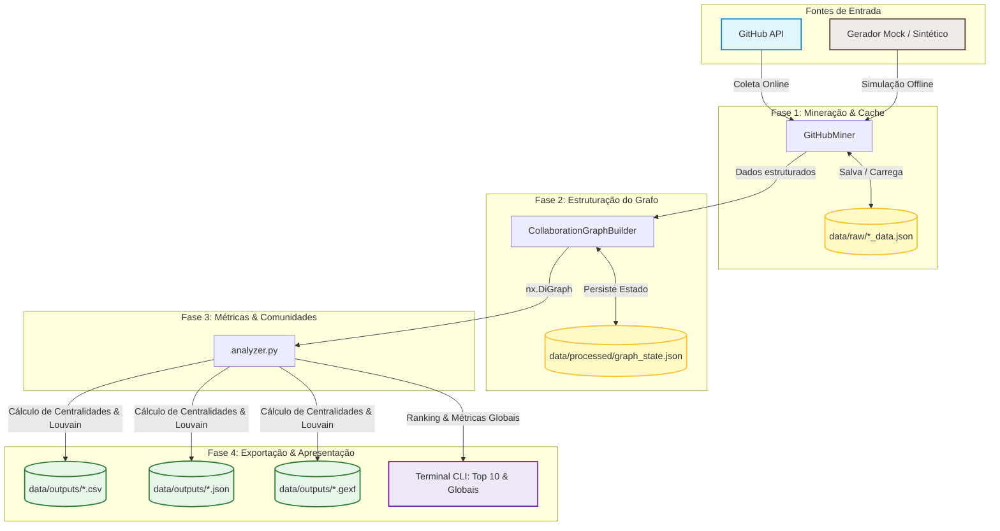

# FastAPI Graph Analysis

Análise de colaboração no ecossistema **FastAPI** usando Grafos Direcionados e Ponderados baseados nas interações em Issues e Pull Requests.

---

## 📊 Sobre o Projeto

Este projeto automatiza a mineração de interações (comentários e revisões de código) entre desenvolvedores no repositório do **FastAPI** (ou qualquer outro repositório do GitHub), constrói uma rede social de colaboração usando **NetworkX**, calcula métricas de centralidade, detecta comunidades através do algoritmo de **Louvain**, e exporta os dados para análise visual interativa no **Gephi** ou na web.

### 🔄 Pipeline de Fluxo de Dados


---

## 🚀 Como Executar Tudo

Siga os passos abaixo para preparar o ambiente e executar a pipeline completa do projeto.

### 1. Clonar o Repositório e Navegar até a Pasta
```bash
git clone https://github.com/bernardocdm/fastapi-graph-analysis.git
cd fastapi-graph-analysis
```

### 2. Criar e Ativar o Ambiente Virtual

* **No Windows (PowerShell):**
  ```powershell
  python -m venv venv
  .\venv\Scripts\Activate.ps1
  ```

* **No Linux / macOS:**
  ```bash
  python3 -m venv venv
  source venv/bin/activate
  ```

### 3. Instalar as Dependências
```bash
pip install -r requirements.txt
```

### 4. Executar o Script Principal (`main.py`)

O pipeline central do projeto é controlado pelo arquivo `main.py`. Ele aceita diversos parâmetros de linha de comando para ajustar o comportamento da execução (mineração online, modo simulação/offline, limites de dados, etc.).

#### 💡 Cenários Comuns de Execução:

* **Modo Offline Rápido (Demonstração / Sem API Token):**
  Excelente para testar a pipeline instantaneamente sem se preocupar com limites de requisição da API do GitHub. Utiliza um gerador robusto de dados realistas e simulados.
  ```bash
  python main.py --use-mock
  ```

* **Modo Online Ativo (Mineração no GitHub):**
  Realiza conexões reais com o GitHub API. Se você tiver um token pessoal de acesso, defina-o na variável de ambiente `GITHUB_TOKEN` para evitar limites rígidos de requisição (60 req/hora sem token vs. 5000 req/hora com token).
  
  *No Windows (PowerShell):*
  ```powershell
  $env:GITHUB_TOKEN="seu_token_aqui"
  python main.py --mine --limit 30
  ```
  
  *No Linux / macOS:*
  ```bash
  export GITHUB_TOKEN="seu_token_aqui"
  python main.py --mine --limit 30
  ```

* **Ignorar Cache Local e Forçar Nova Coleta:**
  Por padrão, os dados minerados ficam salvos em cache local. Use `--force-refresh` para atualizar as informações ativamente do GitHub:
  ```bash
  python main.py --mine --limit 50 --force-refresh
  ```

* **Analisar Outro Repositório e Incluir Bots de Automação:**
  Por padrão, robôs como o `dependabot` são filtrados para não poluir as métricas humanas. Você pode desativar essa restrição e analisar outros repositórios públicos:
  ```bash
  python main.py --mine --repo "encode/starlette" --limit 40 --include-bots
  ```

#### 🛠️ Parâmetros Disponíveis da CLI:

| Parâmetro | Tipo | Descrição | Padrão |
| :--- | :--- | :--- | :--- |
| `--mine` | Flag | Ativa a mineração real do repositório no GitHub (via API). | `False` |
| `--use-mock` | Flag | Força o uso imediato de dados simulados (offline). | `False` |
| `--limit` | Inteiro | Limite máximo de Issues/PRs a processar na mineração ativa. | `50` |
| `--include-bots` | Flag | Inclui bots automáticos (ex: `dependabot`) no grafo final. | `False` |
| `--force-refresh` | Flag | Ignora o arquivo de cache JSON local e força uma nova busca online. | `False` |
| `--repo` | String | Nome do repositório no GitHub para processamento. | `"encode/fastapi"` |

---

## 🧪 Como Executar os Testes Automatizados

A suíte de testes unitários garante a estabilidade de toda a lógica do grafo, cálculo de centralidades e exportadores.

Execute os testes com cobertura de código integrada usando o comando:
```bash
pytest tests/ -v --cov=src
```

---

## 🛠️ O Que Já Foi Feito (Implementado)

O projeto conta com uma infraestrutura robusta, testada e pronta para produção:

1. **Configuração Unificada (`src/config.py`):**
   * Criação automatizada de diretórios de trabalho (`data/raw/`, `data/processed/`, `data/outputs/`).
   * Gerenciamento de credenciais via variáveis de ambiente (`GITHUB_TOKEN`).

2. **Módulo de Mineração Inteligente (`src/mining/miner.py`):**
   * Conexão ativa com o GitHub API via biblioteca `PyGithub`.
   * Coleta granular de Issues, Pull Requests, Comentários de discussões e Revisões de código (PR Reviews).
   * Sistema inteligente de **cache local** em formato JSON para otimizar requisições e contornar limites de taxa (Rate Limit).
   * Gerador avançado de **dados realistas simulados (Mock)** reproduzindo perfeitamente as principais interações históricas dos principais desenvolvedores reais do FastAPI.

3. **Modelagem de Grafo de Colaboração (`src/graph/builder.py`):**
   * Construção de um grafo direcionado e ponderado usando a biblioteca **NetworkX**.
   * Regra de Aresta ($A \rightarrow B$): Desenvolvedor $A$ interagiu (comentou ou revisou) em uma Issue ou PR de autoria do Desenvolvedor $B$.
   * Regra de Peso: A soma total de comentários e revisões realizados entre a dupla de desenvolvedores determina a força da conexão.
   * Filtro opcional e dinâmico de bots.
   * Serialização do estado do grafo completo em JSON no padrão Node-Link (`data/processed/graph_state.json`).
   
   **Modelo Conceitual do Grafo:**
   ```mermaid
   graph LR
       subgraph Context ["Regra de Interação"]
           DevA["Desenvolvedor A <br/>(Autor da Issue / PR)"]
           DevB["Desenvolvedor B <br/>(Comentador / Revisor)"]
           
           DevB -->|Comentário ou Review| DevA
       end

       subgraph NetworkModel ["Representação no NetworkX"]
           NodeB((Nó: Desenvolvedor B)) -->|Aresta Direcionada| NodeA((Nó: Desenvolvedor A))
           
           NodeB -.-> AttrB["Atributos do Nó:<br/>• avatar_url<br/>• user_type<br/>• contributions<br/>• Centralidades (PageRank, etc.)<br/>• community (Louvain ID)"]
           
           NodeB -->|weight = comments + reviews| NodeA
       end
       
       style DevA fill:#bbdefb,stroke:#1976d2,stroke-width:1px
       style DevB fill:#c8e6c9,stroke:#388e3c,stroke-width:1px
   ```

4. **Analisador de Métricas de Rede (`src/analysis/analyzer.py`):**
   * Cálculo robusto de métricas individuais para cada nó da rede:
     * **In-Degree Centrality** (quem atrai mais comentários e revisões).
     * **Out-Degree Centrality** (quem mais interage ativamente nas postagens alheias).
     * **Betweenness Centrality** (principais pontes/articuladores de comunicação).
     * **Closeness Centrality** (proximidade média na rede).
     * **PageRank Ponderado** (prestígio e influência relativa dos desenvolvedores na rede).
   * Algoritmo de **Louvain** integrado para detecção automatizada de comunidades de colaboradores.
   * Cálculo de métricas estruturais globais (Densidade, Reciprocidade mútua, Agrupamento médio (Clustering coefficient), quantidade de Componentes conexos fracos/fortes e Diâmetro da rede com tratamento robusto para grafos desconectados).

5. **Módulo de Exportação e Saídas (`src/export/exporter.py`):**
   * **`.gexf` (Gephi):** Exportação enriquecida contendo as métricas de centralidade e os IDs de comunidades Louvain embutidos em cada nó, ideal para visualização espacial avançada.
   * **`.json` (Node-Link):** Formato padrão perfeito para consumo imediato por bibliotecas web interativas de visualização de redes, como *D3.js*, *Vis.js* ou *Sigma.js*.
   * **`.csv` (Metrics Table):** Planilha organizada contendo as estatísticas consolidadas de cada desenvolvedor participante para análise estatística ou plotagem rápida.

6. **Interface de Terminal Interativa (`main.py`):**
   * Orquestração fluida de todo o processo em quatro etapas sequenciais.
   * Exibição automatizada de estatísticas globais e exibição de um lindo ranking das 10 figuras mais influentes baseado no prestígio do PageRank.

7. **Suíte Completa de Testes (`tests/test_all.py`):**
   * 100% dos testes unitários passando.
   * Validação de fluxos de diretórios, mock, lógica de ponderação de arestas, regras de centralidade e integridade física de arquivos gerados.

---

## 📅 O Que Falta (Próximos Passos)

Identificamos as seguintes frentes de evolução recomendadas para o projeto:

* [ ] **Pipeline de Integração Contínua (CI):** Implementação de fluxo do GitHub Actions para rodar a suíte `pytest` a cada push ou PR enviado.
* [ ] **Dashboard Web Interativo:** Criação de um frontend web simples para carregar interativamente o arquivo `collaboration_graph.json` gerado na pasta de outputs, permitindo que o usuário explore a rede de forma visual no navegador.
* [ ] **Análise Temporal da Rede:** Funcionalidade para comparar a evolução estrutural da rede de forma cronológica (ex: analisar fotos do grafo mês a mês para captar o amadurecimento e a mudança na liderança técnica do projeto).
* [ ] **Suporte a Outras Plataformas:** Extensão do módulo de mineração para coletar dados a partir de logs locais de repositórios Git clássicos ou da API do GitLab.
* [ ] **Relatório em PDF Computacional (LaTeX):** Redação estruturada e automatização do relatório teórico-prático sobre os resultados das métricas e conclusões obtidas sobre o ecossistema do FastAPI (pasta `relatorio/` a ser criada).
* [ ] **Melhoria de Paginação na API do GitHub:** Adição de controle avançado sobre o rate limit para permitir coletas consecutivas em grandes volumes de dados (ex: acima de 500 issues de uma vez) sem interrupções abruptas.

---

## 📁 Estrutura de Pastas do Projeto

```text
fastapi-graph-analysis/
│
├── main.py                   # CLI principal — orquestra o pipeline completo
├── api_server.py             # Servidor FastAPI para a interface web
│                             #   GET /api/graph   → grafo com métricas por nó
│                             #   GET /api/metrics → métricas globais da rede
├── requirements.txt          # Dependências Python
├── pytest.ini                # Configuração do pytest
│
├── src/                      # Código-fonte do backend
│   ├── config.py             # Caminhos globais e leitura do GITHUB_TOKEN
│   ├── mining/
│   │   └── miner.py          # GitHubMiner: coleta issues/PRs/comentários/reviews + mock data
│   ├── graph/
│   │   └── builder.py        # CollaborationGraphBuilder: constrói DiGraph ponderado (NetworkX)
│   ├── analysis/
│   │   └── analyzer.py       # Centralidades (5), comunidades Louvain, métricas globais
│   ├── export/
│   │   └── exporter.py       # Exporta GEXF (Gephi), JSON (D3.js) e CSV
│   └── api/
│       └── routes.py         # [vazio] placeholder para rotas separadas do api_server.py
│
├── tests/
│   ├── test_all.py           # 5 testes unitários (todos passando)
│   └── fixtures/             # [vazio] futuro: dados fixos para testes
│
├── data/                     # Gerado em runtime — não versionado (exceto processed/)
│   ├── raw/                  # Cache JSON bruto da GitHub API (.gitignore)
│   ├── processed/
│   │   └── graph_state.json  # Estado intermediário do grafo (node-link)
│   └── outputs/
│       ├── collaboration_graph.json  # Grafo completo com métricas — consumido pela API
│       ├── collaboration_graph.gexf  # Grafo para visualização no Gephi
│       └── collaboration_metrics.csv # Tabela com centralidades por contribuidor
│
├── frontend/                 # Interface web (em desenvolvimento — React + Vite + Tailwind)
│   ├── package.json          # [vazio] dependências a instalar
│   └── src/
│       └── public/           # [vazio] futuro: index.html e assets
│
├── docs/
│   ├── class-diagram.puml    # Diagrama UML de classes (PlantUML)
│   └── flow-diagram.puml     # Diagrama de sequência do pipeline
│
└── relatorio/                # [vazio] futuro: relatório LaTeX
```

---

## 🔗 Links e Recursos Recomendados

* **FastAPI (Repositório Alvo):** [https://github.com/encode/fastapi](https://github.com/encode/fastapi)
* **Gephi (Software de Visualização):** [https://gephi.org/](https://gephi.org/)
* **NetworkX (Análise de Redes em Python):** [https://networkx.org/](https://networkx.org/)
* **D3.js (Visualizações Interativas):** [https://d3js.org/](https://d3js.org/)

---

**Status:** Pronto para execução e análise visual. 🚀
